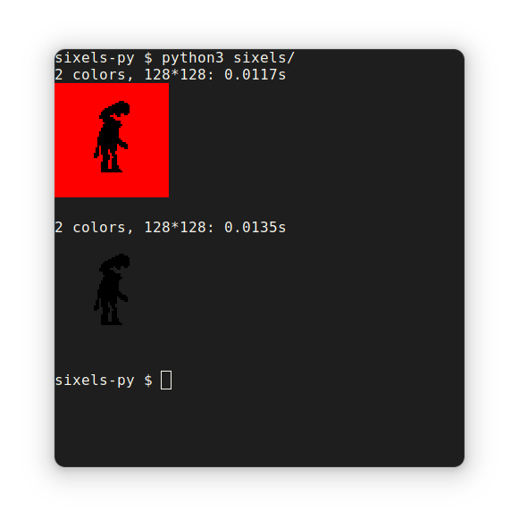

# Sixels-Py
This is my attempt at writing an efficient [sixel](https://en.wikipedia.org/wiki/Sixel) encoder in Python. It is fairly lightweight, and uses only PIL as a dependency.



## Sixel format
During development of this project, I found myself increasinly frustrated by the lack of comprehendable documentation for the format. The format in of itself is quite simple, but it's easy to get lost at specifics, like transparency.


  

```
\x1bPq1;1;"1;1;12;12$
#0;2;92;95;100#1;2;0;0;0
#0~~pp^nr~pp~~$#1??MM_OK?MM??-
#0~~zveddfvz~~$#1??CGXYYWGC??-
\x1b\\
```
*the sixel format doesn't use newlines, they are here for readability*

Line one contains the escape code for initialising a sixel, `\x1bPq`. The data following are the parameters for the sixel. [Black Box](https://gitlab.gnome.org/raggesilver/blackbox), the emulator I am using, doesn't seem to care too much at all about these parameters. Anyway, the format is as following:

- P1:  
The P1 (`1;`) parameter was used to control the aspect ratio of rendered pixels. It has been deprecated long since, and doesn't serve a function today. The possible values, specifying width:height are as follows:

|  **Value**  |  **Aspect Ratio**  |
:------------:|:------------------:|
|  None       |  2:1               |
|  0, 1       |  2:1               | 
|  2          |  5:1               |
|  3, 4       |  3:1               |
|  5, 6       |  2:1               |
|  7, 8, 9    |  1:1               |

- P2  
The P2 (`1;`) parameter decides if the renderer should interpret the first palette index as a transparent color or not. My program achives transparency simply by not appending data for any colour for transparent pixels, but I am sceptical as to whether or not this is specification compliant. If set to 0 or 2, the first palette colour will be interpreted as a reference to the background of the terminal. If set to 1, the palette index will be interpreted as is.

- Raster attributes  
`"1;1;12;12` is a control function to overwrite the aspect ratio defined in P1. The format is `"{pixel_height}:{pixel_width};{image_height};{image_width}`. You are supposed to be able to change the aspect ratio of a rendered pixel with this. The reason for the existance of the last two parameters is unclear. The original documentation itself states that the sixel data width and height should overwrite this parameter. The VT300 interpreted a 0 or 2 in P2 as a setting to enable background discarding.

At the end of the parameters, we append a `$`. This means overdraw and is used in the data section. 

Line two contains the palette colour definitions for the sixel. It's a string of reference numbers which the sixel data string uses to enable coloured rendering. Let's focus on a single palette item, they are all of the same structure. `#0;2;92;95;100`, by `#0;`, defines our 0th palette colour. The index is followed by a `2;`. This sets the colour mode to RGB, the way in which the following last three parameters should be interpreted. Another available colour mode is HSL, but I haven't used it personally, neither have I seen anyone else use it. Lastly, the palette item sets the actual colour using `92;95;100`. Please note that these colours are specified in red, green and blue, ranging between 0 and 100, as opposed to the standard today, 0 to 255. To add more palette items, just follow the preceeding item with a new index. Do **not** separate the palette items with semicolons. Example: `#0;2;92;95;100#1;2;0;0;0`. You can have a maximum of 256 (0 to 255) palette colours.

Line three and four contains the data section of the sixel image. First we start by selecting a colour to draw with, `#0`. Then we append bit data encoded in ascii, each character of which being associated with 1 horizontal and 6 vertical pixels on screen. The ascii corresponds to six bits. The least significant bit is rendered at the top of the sixel. In an example, `000101` would render a column filled at the top pixel, followed by a gap of one pixel, a last pixel and then a blank space for three pixels at the bottom. We can encode this to an ascii symbol by appending the decimal number 63 to the binary number, then getting the corresponding ascii symbol of that index. The first coloured row continues like this with the symbols `~~pp^nr~pp~~`, before we run into a `$`. As you might have read above, this symbol instructs the renderer to overdraw on the line which we are currently drawing. This allows to render as many colours as we want from our palette onto a single row. We continue with `#1??MM_OK?MM??`, before finally terminating this row with a `-`. This hyphen instructs the renderer that we are done with the line, and that want to move on to the next row of six pixels in height. The row following is in the same pattern as the first one.

While my renderer doesn't implement it for performance reasons, the sixel format also supports [run-length encoding](https://en.wikipedia.org/wiki/Run-length_encoding). To use RLE, concatenate equal bit representators to a single ascii letter, followed by an `!` and the original number of equal symbols in the sequence, like this: `O!14`.

On line five, we terminate the sixel using the `\x1b\\` sequence. 

### Further reading
https://vt100.net/docs/vt3xx-gp/chapter14.html  
https://en.wikipedia.org/wiki/Sixel
